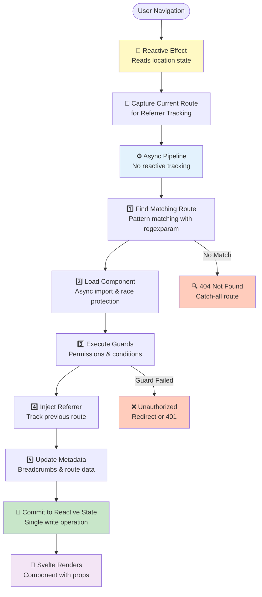

# @keenmate/svelte-spa-router

[](https://www.npmjs.com/package/@keenmate/svelte-spa-router)
[](https://github.com/keenmate/svelte-spa-router/blob/master/LICENSE.md)

A modern router for [Svelte 5](https://github.com/sveltejs/svelte) applications, built from the ground up using the new runes API (`$props`, `$state`, `$effect`).

This module is specifically optimized for Single Page Applications (SPA) with dual-mode routing and comprehensive permission management.

Main features:

- **Dual-mode routing**: Supports both hash-based (`#/path`) and history API (`/path`) routing
- Built with **Svelte 5 runes** for better reactivity and performance
- **Type-safe routes**: `defineRoutes()` — single source of truth with IDE autocomplete on route names and params
- **TypeScript-first**: Full generic support for `routeParams()`, `query()`, and `filters()` with intellisense
- **Flexible Navigation**: Multi-parameter signatures, named routes, navigation context (WinForms-like data passing)
- **Referrer Tracking**: Automatic previous route tracking with configurable modes ('never', 'notfound', 'always')
- **Tree/Nested Routes**: Optional hierarchical route structure with automatic path concatenation and inheritance
- **Hierarchical Routes**: Automatic parent-to-child inheritance of breadcrumbs, permissions, and guards
- **Strict Parameter Replacement**: Configurable placeholder for missing route parameters (no silent failures)
- **Global Error Handler**: Production-ready error handling with loop prevention and recovery strategies
- **404 Tracking**: Built-in `onNotFound` callback for analytics and monitoring
- **Querystring & Filter helpers**: Flexible, reactive helpers for URL-driven UIs with auto-detection of array formats
- **Permission system**: Built-in role-based AND resource-based access control with route guards
- Insanely simple to use, and has a minimal footprint
- Uses the tiny [regexparam](https://github.com/lukeed/regexparam) for parsing routes, with support for parameters (e.g. `/book/:id?`) and more
- No server configuration needed for hash mode; clean URLs with history mode

This module is released under MIT license.

## Installation

```sh
npm install @keenmate/svelte-spa-router
```

> **⚠️ Important:** This package requires **Node.js 22 or higher** for production builds. Node.js 20 has compatibility issues with Svelte 5 that may cause runtime errors like "link is not defined" in production builds. Make sure your build environment (CI/CD, Docker, etc.) uses Node 22+.

## Quick Start: Common Imports

Here are the most frequently used imports and where to get them:

### Basic Router Setup

```javascript
// Main Router component
import Router from '@keenmate/svelte-spa-router'

// Navigation functions - available from main module OR /utils
import { push, replace, pop, goBack } from '@keenmate/svelte-spa-router'
// Alternative:
import { push, replace, pop, goBack } from '@keenmate/svelte-spa-router/utils'

// Link action for <a> tags
import { link } from '@keenmate/svelte-spa-router'
```

### Accessing Route Information

```javascript
// Get current route data (call as functions, not stores!)
import { location, querystring, routeParams, navigationContext } from '@keenmate/svelte-spa-router'

// Usage in components:
const currentPath = $derived(location())        // e.g., "/user/123"
const query = $derived(querystring())           // e.g., "?tab=profile"
const params = $derived(routeParams())          // e.g., { id: "123" }
const context = $derived(navigationContext())   // Navigation context data

// Alternative: Access from /utils
import { location, querystring, routeParams } from '@keenmate/svelte-spa-router'
```

**⚠️ Important:** In route components, prefer receiving `routeParams` as props instead of importing:

```svelte
<script>
// Recommended in route components
let { routeParams = {} } = $props()
</script>

<p>User ID: {routeParams.id}</p>
```

### Route Configuration

```javascript
// Type-safe route definitions (recommended!)
import { defineRoutes } from '@keenmate/svelte-spa-router/routes'

// Wrap routes with loading/conditions
import { wrap } from '@keenmate/svelte-spa-router/wrap'

// Active link highlighting
import active from '@keenmate/svelte-spa-router/active'

// Named routes system
import { registerRoutes, buildUrl } from '@keenmate/svelte-spa-router/routes'
```

### Advanced Features

```javascript
// Permission-based routing
import {
  configurePermissions,
  createProtectedRoute,
  hasPermission
} from '@keenmate/svelte-spa-router/helpers/permissions'

// Navigation guards
import {
  registerBeforeLeave,
  unregisterBeforeLeave,
  NavigationCancelledError
} from '@keenmate/svelte-spa-router/helpers/navigation-guard'

// Hierarchical route structure
import { createHierarchy } from '@keenmate/svelte-spa-router/helpers/hierarchy'

// Error handling
import {
  configureGlobalErrorHandler
} from '@keenmate/svelte-spa-router/helpers/error-handler'
import { GlobalErrorHandler } from '@keenmate/svelte-spa-router/helpers/GlobalErrorHandler'

// URL utilities
import { joinPaths } from '@keenmate/svelte-spa-router/helpers/url-helpers'

// Query string helpers
import {
  parseQuerystring,
  stringifyQuerystring,
  updateQuerystring
} from '@keenmate/svelte-spa-router/helpers/querystring'
```

### All Available Import Paths

```javascript
'@keenmate/svelte-spa-router'                        // Main module (Router, push, location, etc.)
'@keenmate/svelte-spa-router/utils'                  // Alternative path for utils
'@keenmate/svelte-spa-router/wrap'                   // Route wrapping
'@keenmate/svelte-spa-router/active'                 // Active link action
'@keenmate/svelte-spa-router/routes'                 // Named routes system
'@keenmate/svelte-spa-router/constants'              // Constants and enums
'@keenmate/svelte-spa-router/logger'                 // Debug logging
'@keenmate/svelte-spa-router/helpers/permissions'    // Permission system
'@keenmate/svelte-spa-router/helpers/navigation-guard'  // Navigation guards
'@keenmate/svelte-spa-router/helpers/hierarchy'      // Hierarchical routes
'@keenmate/svelte-spa-router/helpers/error-handler'  // Error handling
'@keenmate/svelte-spa-router/helpers/GlobalErrorHandler'  // Error component
'@keenmate/svelte-spa-router/helpers/url-helpers'    // URL utilities
'@keenmate/svelte-spa-router/helpers/querystring'    // Query string helpers
'@keenmate/svelte-spa-router/helpers/route-metadata' // Breadcrumbs/metadata
'@keenmate/svelte-spa-router/helpers/filters'        // Filter parsing
```

**❌ Common Mistake:**

```javascript
// ❌ WRONG - /stores path doesn't exist (this was the old v3/v4 API)
import { routeParams } from '@keenmate/svelte-spa-router/stores'

// ✅ CORRECT - Import from main module or /utils
import { routeParams } from '@keenmate/svelte-spa-router'
```

> **Note:** This is a Svelte 5 router using runes (`$state`, `$derived`), not Svelte stores. There is no `/stores` export path.

## Debug Logging

The router includes a built-in debug logging system to help troubleshoot routing issues during development.

### Enabling Debug Logs

```javascript
// main.js
import { enableLogging } from '@keenmate/svelte-spa-router/logger'

// Enable debug logs in development only
if (import.meta.env.DEV) {
  enableLogging()  // Enable all categories
}

// Or enable specific categories only
import { disableLogging, setCategoryLevel } from '@keenmate/svelte-spa-router/logger'

disableLogging()  // Disable all first
setCategoryLevel('ROUTER:SCROLL', 'debug')  // Enable only scroll logs
setCategoryLevel('ROUTER:NAVIGATION', 'info')  // Enable navigation at info level
```

### What Gets Logged

The router provides **12 hierarchical logging categories** for granular control:

| Category | Description |
|----------|-------------|
| `ROUTER` | Core routing pipeline, route matching |
| `ROUTER:NAVIGATION` | push, pop, replace, goBack |
| `ROUTER:SCROLL` | Scroll restoration |
| `ROUTER:GUARDS` | Navigation guards |
| `ROUTER:CONDITIONS` | Route condition checks |
| `ROUTER:HIERARCHY` | Hierarchical route inheritance |
| `ROUTER:PERMISSIONS` | Permission checking |
| `ROUTER:ROUTES` | Named routes and URL building |
| `ROUTER:ZONES` | Multi-zone routing |
| `ROUTER:METADATA` | Breadcrumbs and route metadata |
| `ROUTER:ERROR_HANDLER` | Global error handling |
| `ROUTER:FILTERS` | Filter parsing |

**Example output:**
```
[13:42:48.123] [DEBUG] [ROUTER] Running pipeline for: /document/123
[13:42:48.234] [DEBUG] [ROUTER] Route loaded successfully: /document/:id
[13:42:48.345] [DEBUG] [ROUTER:NAVIGATION] Called - navigationContext: { source: 'menu' }
[13:42:48.456] [DEBUG] [ROUTER:SCROLL] Scroll effect triggered - restoreScrollState: true
```

### Advanced Logging Control

```javascript
import { setLogLevel, setCategoryLevel } from '@keenmate/svelte-spa-router/logger'

// Set global log level (affects all categories)
setLogLevel('warn')  // Only show warnings and errors

// Enable specific categories at different levels
disableLogging()  // Start with all disabled
setCategoryLevel('ROUTER:SCROLL', 'debug')  // Debug scroll issues
setCategoryLevel('ROUTER:PERMISSIONS', 'info')  // Monitor permission checks
```

**Log Levels:** `trace`, `debug`, `info`, `warn`, `error`, `silent`

### Filtering Logs

To focus on specific router logs in your browser console:

- Filter by `ROUTER` to see all router logs
- Filter by `ROUTER:SCROLL` to see only scroll-related logs
- Filter by `[ERROR]` to see only errors

Debug logs are **disabled by default** to keep production consoles clean.

## Key Features

This router leverages Svelte 5's runes and provides:

### 1. Stores are now functions

In Svelte 5 version, location stores are accessed as functions instead of Svelte stores:

**Example:**
```svelte
<script>
import { routeParams} from '@keenmate/svelte-spa-router'
</script>
<p>Current location: {location()}</p>
<p>Querystring: {querystring()}</p>
<p>Params: {JSON.stringify(routeParams())}</p>
```

### 2. Event handlers use props instead of `on:` directives

**Example:**
```svelte
<Router {routes}
  onRouteLoading={handleLoading}
  onRouteLoaded={handleLoaded}
  onConditionsFailed={handleFailed}
/>
```

### 3. Internal implementation uses runes

The router now uses:
- `$state` for reactive state management
- `$props` for component props
- `$effect` for side effects (location tracking, scroll restoration)
- `$derived` for computed values

This provides better performance and follows Svelte 5 best practices.

## Architecture

The router uses a **pipeline architecture** for clean separation of concerns:



### Key Benefits

- **No `untrack()` calls needed**: Pipeline runs outside reactive context
- **Race condition safety**: Each navigation has a unique ID to prevent stale updates
- **Single write point**: All state updates happen in one place (`commitToReactiveState`)
- **Testable**: Pure functions for each pipeline stage
- **Extensible**: Easy to add new stages or modify existing ones

## Routing Modes

svelte-spa-router-5 supports two routing modes:

### Hash Mode (Default)

Uses hash-based routing with URLs like `http://example.com/#/path`.

**Pros:**
- No server configuration needed
- Works everywhere, including `file://` protocol
- Perfect for static hosting (GitHub Pages, Netlify, etc.)

**Cons:**
- URLs have `#` in them
- Less SEO-friendly (though modern search engines handle it)

**Usage:** No configuration needed - this is the default!

```svelte
<!-- App.svelte -->
<Router {routes}/>
```

### History Mode

Uses the History API with clean URLs like `http://example.com/path`.

**Pros:**
- Clean URLs without `#`
- More SEO-friendly
- Better user experience
- Supports modifier keys (Ctrl+Click to open in new tab)
- Respects `target` attribute on links

**Cons:**
- Requires server configuration to serve `index.html` for all routes
- Won't work with `file://` protocol

**Usage:** Configure before mounting your app

```javascript
// main.js
import { mount } from 'svelte'
import { setHashRoutingEnabled, setBasePath } from '@keenmate/svelte-spa-router'
import App from './App.svelte'

// Enable history mode
setHashRoutingEnabled(false)
setBasePath(import.meta.env.BASE_URL || '/')

// Mount app
mount(App, { target: document.body })
```

**Server Configuration:**

For production, configure your server to serve `index.html` for all routes:

```nginx
# Nginx
location / {
    try_files $uri $uri/ /index.html;
}
```

```apache
# Apache .htaccess
<IfModule mod_rewrite.c>
  RewriteEngine On
  RewriteBase /
  RewriteRule ^index\.html$ - [L]
  RewriteCond %{REQUEST_FILENAME} !-f
  RewriteCond %{REQUEST_FILENAME} !-d
  RewriteRule . /index.html [L]
</IfModule>
```

```javascript
// Express.js
app.get('*', (req, res) => {
  res.sendFile(path.join(__dirname, 'dist', 'index.html'))
})
```

**Base Path Configuration:**

If your app is served from a subdirectory (e.g., `http://example.com/app/`):

```javascript
setBasePath('/app')
```

Make sure to also set it in your build tool:

```javascript
// vite.config.js
export default {
  base: '/app/'
}
```

**Examples:**
- See `example/` for hash mode (default)
- See `example-history/` for history mode with clean URLs

## Usage

### Define your routes

Each route is a normal Svelte component. The route definition is a JavaScript dictionary (object) where the key is the path and the value is the component.

```js
import Home from './routes/Home.svelte'
import Author from './routes/Author.svelte'
import Book from './routes/Book.svelte'
import NotFound from './routes/NotFound.svelte'

const routes = {
    // Exact path
    '/': Home,

    // Using named parameters, with last being optional
    '/author/:first/:last?': Author,

    // Wildcard parameter
    '/book/*': Book,

    // Catch-all (must be last)
    '*': NotFound,
}
```

### Define routes with type safety (Recommended)

Use `defineRoutes()` for a single source of truth that gives you IDE autocomplete on route names and parameters, preventing typos at compile time:

```javascript
// src/routes.js (or routes.ts for TypeScript)
import { defineRoutes } from '@keenmate/svelte-spa-router/routes'
import Home from './routes/Home.svelte'

const { routes, nav, paths } = defineRoutes({
  home: {
    path: '/',
    component: Home
  },
  about: {
    path: '/about',
    component: () => import('./routes/About.svelte')
  },
  user: {
    path: '/user/:id',
    component: () => import('./routes/User.svelte'),
    conditions: [checkAuth],
    breadcrumbs: [{ label: 'Users' }, { id: 'user', label: 'User' }]
  },
  settings: {
    path: '/settings',
    component: () => import('./routes/Settings.svelte'),
    permissions: { any: ['settings.read'] }
  }
})

export { routes, nav, paths }
```

**Use in App.svelte:**

```svelte
<script>
import Router from '@keenmate/svelte-spa-router'
import { link } from '@keenmate/svelte-spa-router'
import { routes, nav, paths } from './routes'
</script>

<!-- Pass routes to Router -->
<Router {routes} />

<!-- Links with autocomplete on route names + params -->
<a href={paths.user({ id: 123 })} use:link>User 123</a>
<a href={paths.about()} use:link>About</a>

<!-- Programmatic navigation -->
<button onclick={() => nav.user.push({ id: 42 })}>Go to User 42</button>
<button onclick={() => nav.settings.replace()}>Settings</button>

<!-- For use:link action -->
<a use:link={nav.user.link({ id: 99 })}>User 99</a>
```

**What `defineRoutes()` returns:**

| Property | Description |
|----------|-------------|
| `routes` | Standard routes object for `<Router {routes} />` |
| `nav.X.push(params?, query?, ctx?)` | Navigate to route X (calls `push()` internally) |
| `nav.X.replace(params?, query?, ctx?)` | Replace with route X (calls `replace()` internally) |
| `nav.X.link(params?, query?)` | Returns object for `use:link` action |
| `nav.X.path` | Raw path pattern (e.g. `'/user/:id'`) |
| `paths.X(params?, query?)` | Build URL string for `href` attributes |

**TypeScript support:**

In TypeScript, `defineRoutes()` extracts `:param` names from path patterns at the type level:

```typescript
const { nav, paths } = defineRoutes({
  user: { path: '/user/:id', component: UserPage }
})

nav.user.push({ id: 123 })       // ✅ TypeScript knows 'id' is required
nav.user.push({ userId: 123 })   // ❌ Type error — 'userId' doesn't exist
nav.user.push()                   // ✅ OK — params are optional at runtime
paths.user({ id: 123 })          // ✅ Returns '/user/123'
```

**Supported route options:**

Each route in `defineRoutes()` accepts `path`, `component`, and all existing `createRoute()` / `wrap()` options: `loadingComponent`, `loadingParams`, `conditions`, `props`, `routeContext`, `title`, `breadcrumbs`, `shouldDisplayLoadingOnRouteLoad`, `permissions`, `authorizationCallback`, and inheritance flags (`inheritBreadcrumbs`, `inheritPermissions`, etc.).

> **Note:** `defineRoutes()` automatically calls `registerRoutes()` internally — no separate registration step is needed. Named routes work immediately with `push()`, `replace()`, and `buildUrl()`.

### Include the router

In your main component (usually `App.svelte`):

```svelte
<script>
import Router from '@keenmate/svelte-spa-router'
import routes from './routes'
</script>

<Router {routes}/>
```

### Navigating between pages

Using links with the `use:link` action:

```svelte
<script>
import {link} from '@keenmate/svelte-spa-router'
</script>

<a href="/book/123" use:link>View Book</a>
```

Programmatically with multiple formats:

```js
import {push, pop, replace} from '@keenmate/svelte-spa-router'

// String format (simple paths)
push('/book/42')

// Multi-parameter signature (NEW!)
push('userProfile', { userId: 123 }, { tab: 'settings' })
// Route name starting with / = exact path, otherwise = named route lookup
push('/about', {}, { source: 'nav' })

// Array format (with named routes)
push(['userProfile', { userId: 123 }])

// Array with query parameters
push(['userProfile', { userId: 123 }, { tab: 'settings' }])

// Array with navigation context (4 elements)
push(['userProfile', { userId: 123 }, { tab: 'settings' }, { source: 'menu' }])

// Object format (most explicit)
push({
  route: 'userProfile',
  params: { userId: 123 },
  query: { tab: 'settings', page: '2' }
})

// Object with navigation context
push({
  route: 'userProfile',
  params: { userId: 123 },
  query: { tab: 'settings' },
  navigationContext: { source: 'toolbar', userId: 789 }
})

// Go back (browser back button)
pop()

// Go back to referrer (with scroll restoration) - requires referrer tracking
goBack()

// Replace current page (supports all formats above)
replace('/book/3')
replace(['bookDetail', { bookId: 456 }])
replace('bookDetail', { bookId: 456 }, { preview: 'true' })
```

**Note:** To use named routes with `push()` and `replace()`, you need to register your routes first:

```js
import { registerRoutes } from '@keenmate/svelte-spa-router/routes'

registerRoutes({
  home: '/',
  userProfile: '/user/:userId',
  bookDetail: '/book/:bookId'
})
```

### Navigation Context

Pass data during navigation without showing it in the URL (similar to WinForms):

```js
import { push, navigationContext } from '@keenmate/svelte-spa-router'

// Navigate with hidden context data
await push('/order-confirmation', {
  orderId: 12345,
  customer: 'Alice',
  totalAmount: 99.99
})

// In the target route component, access the context
const navContext = $derived(navigationContext())
// { orderId: 12345, customer: 'Alice', totalAmount: 99.99 }
```

Navigation context:
- Does NOT appear in the URL
- Perfect for passing sensitive data or large objects
- Accessible via `navigationContext()` in the target route
- Cleared when user manually navigates (types URL, refreshes, etc.)

### Referrer Tracking

Automatically track and navigate back to the previous route with full context preservation.

#### Enabling Referrer Tracking

Configure in your main.js before mounting the app:

```javascript
// main.js
import { setIncludeReferrer } from '@keenmate/svelte-spa-router'

setIncludeReferrer('always')  // Track referrer for all routes
```

**Configuration Options:**
- `'never'` (default) - Disable referrer tracking
- `'notfound'` - Track referrer only for 404/catch-all routes
- `'always'` - Track referrer for all navigation

#### Using goBack() for "Go Back" Buttons

The `goBack()` helper provides the best way to navigate back with automatic scroll restoration:

```svelte
<script>
import { goBack, navigationContext } from '@keenmate/svelte-spa-router'

const navContext = $derived(navigationContext())
const referrer = $derived(navContext?.referrer)
</script>

{#if referrer}
    <button onclick={goBack}>← Back to {referrer.location}</button>
{/if}
```

**How it works:**
- Navigates using browser's native back button (`window.history.back()`)
- Automatically restores scroll position from when you first visited that page
- Preserves the original referrer (not chronological previous route)
- Falls back to `pop()` if no referrer exists

> **⚠️ Important:** Use `goBack()` instead of manual `push(referrer.location)` to get automatic scroll restoration and proper back navigation behavior.

#### What Gets Tracked

The referrer object includes complete route context:

```javascript
{
  location: '/documents/123',      // Previous route path
  querystring: 'tab=settings',     // Query string
  params: { id: '123' },           // Route parameters
  routeName: 'documentDetail',     // Named route (if using named routes)
  scrollX: 0,                      // Scroll position when leaving
  scrollY: 245                     // Scroll position when leaving
}
```

#### How It Works

Referrers are automatically preserved in browser history:

1. When you navigate forward, the router calculates the referrer and saves it to `history.state`
2. When you press browser back/forward buttons, the referrer is restored from history
3. Referrer tracking respects your routing mode (hash or history API)
4. Scroll position is automatically saved and restored by `goBack()`

The referrer is cleared when users manually type a URL or refresh the page.

#### Advanced: Manual Navigation

For cases requiring custom logic before navigation:

```svelte
<script>
import { push, navigationContext } from '@keenmate/svelte-spa-router'

const navContext = $derived(navigationContext())
const referrer = $derived(navContext?.referrer)

function customGoBack() {
    if (!referrer?.location) {
        // No referrer - fallback to home
        push('/')
        return
    }

    // Custom logic before navigation
    if (await confirmUnsavedChanges()) {
        const url = referrer.querystring
            ? `${referrer.location}?${referrer.querystring}`
            : referrer.location
        push(url)
        // Note: Manual push does NOT restore scroll position
    }
}
</script>
```

> **Migration Note:** If you're currently using manual `push(referrer.location)` pattern, switch to `goBack()` for automatic scroll restoration and proper history navigation.

#### Benefits over history.back()

- **Automatic scroll restoration** - Returns to exact scroll position when you left
- **Preserved in browser history** - Works with browser back/forward buttons
- **Works with replace() navigation** - Referrer persists even when using `replace()`
- **Conditional logic** - Check referrer before navigating back
- **Full route context** - Access to params, querystring, route name
- **Custom fallback** - Redirect to home or other route when no referrer exists

### Strict Parameter Replacement

Configure how missing route parameters are handled:

```javascript
// main.js
import { setParamReplacementPlaceholder } from '@keenmate/svelte-spa-router'

// Set placeholder for missing parameters (default: 'N-A')
setParamReplacementPlaceholder('N-A')
```

**Behavior:**

```javascript
// Route pattern: /users/:userId/:section
// If userId is provided but section is missing:
push('userProfile', { userId: 123 })
// Result: /users/123/N-A

// Missing parameters trigger onNotFound callback for error tracking
```

**Why strict replacement?**
- Predictable URLs - no silent parameter removal
- Easy to spot missing data in development
- `onNotFound` callback tracks issues for debugging
- Configure placeholder to match your app's style

### Accessing route parameters

In your route components:

```svelte
<script>
let { routeParams = {} } = $props()
</script>

<p>Book ID: {routeParams.id}</p>
```

### Accessing location and querystring

```svelte
<script>
import { routeParams} from '@keenmate/svelte-spa-router'

// Access current location and querystring
const currentPath = $derived(location())
const query = $derived(querystring())
const routeParams = $derived(routeParams())
</script>

<p>Current page: {currentPath}</p>
<p>Query: {query}</p>
<p>Params: {JSON.stringify(routeParams)}</p>
```

### TypeScript Support with Generics

All helper functions support TypeScript generics for full intellisense:

```typescript
// Define your types
interface UserParams {
  userId: string
  tab?: string
}

interface UserQuery {
  search?: string
  page?: number
  tags?: string[]
}

// Use with type parameters for full intellisense
const p = $derived(routeParams<UserParams>())
const q = $derived(query<UserQuery>())

if (p) {
  const userId = p.userId        // ✅ TypeScript knows this exists
  const tab = p.tab || 'profile' // ✅ TypeScript knows this is optional
}

const search = $derived(q.search || '')
const page = $derived(q.page ? Number(q.page) : 1)
const tags = $derived(q.tags || [])  // ✅ TypeScript knows this is string[]
```

### Dynamic imports and code-splitting

#### Using createRoute() (Recommended)

The most convenient way to create routes with async loading, metadata, and conditions:

```js
import { createRoute } from '@keenmate/svelte-spa-router/wrap'
import Home from './routes/Home.svelte'
import NotFound from './routes/NotFound.svelte'

const routes = {
    '/': Home,

    // No wrap() needed! createRoute() handles it for you
    '/author/:first/:last?': createRoute({
        component: () => import('./routes/Author.svelte'),
        title: 'Author Profile',
        breadcrumbs: [
            { label: 'Home', path: '/' },
            { label: 'Authors' }
        ]
    }),

    // With loading component
    '/book/*': createRoute({
        component: () => import('./routes/Book.svelte'),
        title: 'Book Details',
        loadingComponent: LoadingPlaceholder,
        loadingParams: { message: 'Loading book...' }
    }),

    '*': NotFound,
}
```

#### Using wrap() Directly (Advanced)

For more control, use `wrap()` directly or with `createRouteDefinition()`:

```js
import { wrap, createRouteDefinition } from '@keenmate/svelte-spa-router/wrap'
import Home from './routes/Home.svelte'
import NotFound from './routes/NotFound.svelte'

const routes = {
    '/': Home,

    // Direct wrap() syntax
    '/author/:first/:last?': wrap({
        asyncComponent: () => import('./routes/Author.svelte')
    }),

    // Using createRouteDefinition() for consistency
    '/book/*': wrap(createRouteDefinition({
        component: () => import('./routes/Book.svelte'),
        loadingComponent: LoadingPlaceholder,
        loadingParams: { message: 'Loading book...' }
    })),

    '*': NotFound,
}
```

**Metadata Access:**

Title and breadcrumbs are stored in `userData` and accessible in route events:

```svelte
<script>
let { routeParams = {}, userData = {} } = $props()

// Access metadata
const title = userData.title
const breadcrumbs = userData.breadcrumbs || []
</script>

<h1>{title || 'Default Title'}</h1>

{#if breadcrumbs.length > 0}
<nav>
  {#each breadcrumbs as crumb}
    {#if crumb.path}
      <a href={crumb.path} use:link>{crumb.label}</a>
    {:else}
      <span>{crumb.label}</span>
    {/if}
  {/each}
</nav>
{/if}
```

### Loading States & Dynamic Metadata

The router provides flexible loading control with support for three distinct patterns, allowing you to choose the approach that best fits your application architecture.

#### Pattern 1: Router-managed Loading (Zone-specific)

Use `loadingComponent` with `shouldDisplayLoadingOnRouteLoad: true` for multi-zone layouts where the Router manages the loading state:

```javascript
import { createRoute } from '@keenmate/svelte-spa-router/wrap'
import { hideLoading } from '@keenmate/svelte-spa-router/helpers/route-metadata'
import Loading from './components/Loading.svelte'

const routes = {
    '/document/:id': createRoute({
        component: () => import('./routes/DocumentDetail.svelte'),
        loadingComponent: Loading,
        shouldDisplayLoadingOnRouteLoad: true,  // Keep loading visible until component signals ready
        title: 'Document Detail',
        breadcrumbs: [
            { label: 'Home', path: '/' },
            { label: 'Documents', path: '/metadata-demo' },
            { id: 'documentDetail', label: 'Loading...', path: '/document/:id' }
        ]
    })
}
```

In your component, signal when data is loaded:

```svelte
<script>
import { onMount } from 'svelte'
import { hideLoading, updateTitle, updateBreadcrumb } from '@keenmate/svelte-spa-router/helpers/route-metadata'

let { routeParams } = $props()
let document = $state(null)

onMount(async () => {
    // Fetch data
    document = await fetchDocument(routeParams.id)

    // Update metadata with loaded data
    updateTitle(document.name)
    updateBreadcrumb('documentDetail', {
        label: document.name,
        path: `/document/${routeParams.id}`
    })

    // Signal that loading is complete
    hideLoading()
})
</script>

<h1>{document?.name || 'Loading...'}</h1>
```

**Perfect for:**
- Multi-zone layouts (toolpanel + content areas)
- Apps where each zone needs its own loading UI
- When you want the Router to manage loading component visibility

#### Pattern 2: Component-managed Loading (Default)

Components handle their own loading state with no special configuration:

```javascript
const routes = {
    '/product/:id': createRoute({
        component: () => import('./routes/ProductDetail.svelte'),
        title: 'Product Detail'
    })
}
```

```svelte
<script>
let { routeParams } = $props()
let product = $state(null)
let loading = $state(true)

onMount(async () => {
    product = await fetchProduct(routeParams.id)
    loading = false
})
</script>

{#if loading}
    <div class="loading">Loading product...</div>
{:else}
    <h1>{product.name}</h1>
    <p>{product.description}</p>
{/if}
```

**Perfect for:**
- Simple apps with straightforward loading needs
- Components that manage their own UI states
- When you want full control over loading presentation

#### Pattern 3: Global Loading Overlay (User-defined)

Define a global loading overlay in your `App.svelte` that reacts to route loading state:

```svelte
<!-- App.svelte -->
<script>
import { routeIsLoading } from '@keenmate/svelte-spa-router/helpers/route-metadata'
import Router from '@keenmate/svelte-spa-router'

const isLoading = $derived(routeIsLoading())
</script>

<div class="app">
    {#if isLoading}
    <div class="global-loading-overlay">
        <div class="spinner"></div>
        <p>Loading...</p>
    </div>
    {/if}

    <Router {routes} />
</div>

<style>
.global-loading-overlay {
    position: fixed;
    top: 0;
    left: 0;
    right: 0;
    bottom: 0;
    background: rgba(0, 0, 0, 0.5);
    display: flex;
    align-items: center;
    justify-content: center;
    z-index: 9999;
}
</style>
```

Then manually control loading in your components:

```svelte
<script>
import { showLoading, hideLoading } from '@keenmate/svelte-spa-router/helpers/route-metadata'

let { routeParams } = $props()
let data = $state(null)

async function loadData() {
    showLoading()  // Show global overlay
    try {
        data = await fetchData(routeParams.id)
    } finally {
        hideLoading()  // Hide global overlay
    }
}

onMount(loadData)
</script>
```

**Perfect for:**
- Consistent loading UI across entire app
- Apps with complex async operations beyond route loading
- When you want a single global loading indicator

#### Combining Patterns

You can combine Pattern 1 and Pattern 3 for comprehensive loading feedback:

```javascript
// Route uses both loadingComponent and triggers global overlay
'/document/:id': createRoute({
    component: () => import('./routes/DocumentDetail.svelte'),
    loadingComponent: Loading,  // Zone-specific loading
    shouldDisplayLoadingOnRouteLoad: true,  // Also triggers global overlay
    title: 'Document Detail'
})
```

This shows both:
- The `Loading` component in the content area (zone-specific)
- The global overlay (if defined in App.svelte)

#### Dynamic Metadata Helpers

Update page metadata after data loads:

```javascript
import {
    updateTitle,           // Update just the title
    updateBreadcrumb,      // Update specific breadcrumb by ID
    updateRouteMetadata    // Update full metadata object
} from '@keenmate/svelte-spa-router/helpers/route-metadata'

// Update title only
updateTitle('Invoice.pdf')

// Update specific breadcrumb by ID (partial update)
updateBreadcrumb('documentDetail', {
    label: 'Invoice.pdf',
    path: '/document/123'
})

// Update full metadata
updateRouteMetadata({
    title: 'Invoice.pdf',
    breadcrumbs: [
        { label: 'Home', path: '/' },
        { label: 'Documents', path: '/documents' },
        { label: 'Invoice.pdf', path: '/document/123' }
    ]
})
```

#### Reactive Metadata Access

Access current route metadata reactively:

```svelte
<script>
import { routeTitle, routeBreadcrumbs, routeContext } from '@keenmate/svelte-spa-router/helpers/route-metadata'

const title = $derived(routeTitle())
const breadcrumbs = $derived(routeBreadcrumbs())
const context = $derived(routeContext())
</script>

<h1>{title || 'Default Title'}</h1>

{#if breadcrumbs.length > 0}
<nav>
    {#each breadcrumbs as crumb}
        {#if crumb.path}
            <a href={crumb.path} use:link>{crumb.label}</a>
        {:else}
            <span>{crumb.label}</span>
        {/if}
    {/each}
</nav>
{/if}
```

**Available helpers:**
```javascript
import {
    // Loading state control
    showLoading,           // Manually show loading state
    hideLoading,           // Hide loading state (signal component is ready)
    routeIsLoading,        // Check if currently loading (reactive)

    // Metadata updates
    updateTitle,           // Update just the title
    updateBreadcrumb,      // Update specific breadcrumb by ID
    updateRouteMetadata,   // Update full metadata object

    // Reactive metadata access
    routeTitle,            // Get current title
    routeBreadcrumbs,      // Get current breadcrumbs
    routeContext            // Get full route context object
} from '@keenmate/svelte-spa-router/helpers/route-metadata'
```

See `/loading-demo` and `/document/:id` routes in the example-history app for complete interactive demos.

### Route guards (pre-conditions)

Basic condition example:

```js
const routes = {
    '/admin': wrap({
        asyncComponent: () => import('./routes/Admin.svelte'),
        conditions: [
            // Can be sync or async
            async (detail) => {
                const user = await checkAuth()
                return user.isAdmin
            }
        ]
    })
}
```

### Permission-based routing

svelte-spa-router-5 includes a flexible permission system for role-based access control:

**1. Configure the permission system (in main.js before mounting):**

```javascript
import { configurePermissions } from '@keenmate/svelte-spa-router/helpers/permissions'
import { get } from 'svelte/store'
import { currentUser } from './stores/auth'

configurePermissions({
  checkPermissions: (user, requirements) => {
    if (!user) return false
    if (!requirements) return true

    // Check if user has any of the required permissions
    if (requirements.any) {
      return requirements.any.some(perm =>
        user.permissions.includes(perm)
      )
    }

    // Check if user has all required permissions
    if (requirements.all) {
      return requirements.all.every(perm =>
        user.permissions.includes(perm)
      )
    }

    return true
  },
  getCurrentUser: () => get(currentUser),
  onUnauthorized: (detail) => {
    push('/unauthorized')
  }
})
```

**2. Protect routes with permissions:**

#### Using createProtectedRoute() (Recommended)

The most convenient way - no wrap() needed!

```javascript
import { createProtectedRoute } from '@keenmate/svelte-spa-router/helpers/permissions'
import { push } from '@keenmate/svelte-spa-router'

const routes = {
  '/': Home,

  // No wrap() needed! createProtectedRoute() returns ready-to-use wrapped component
  '/admin': createProtectedRoute({
    component: () => import('./Admin.svelte'),
    permissions: { any: ['admin.read', 'admin.write'] },
    loadingComponent: Loading,
    title: 'Admin Panel',
    breadcrumbs: [
      { label: 'Home', path: '/' },
      { label: 'Admin' }
    ]
  }),

  // User needs ALL of these permissions
  '/settings': createProtectedRoute({
    component: () => import('./Settings.svelte'),
    permissions: { all: ['settings.read', 'settings.write'] },
    title: 'Settings'
  }),

  // Combine role-based and resource-based authorization (NEW!)
  '/document/:id': createProtectedRoute({
    component: () => import('./DocumentDetail.svelte'),
    // Role-based: User must have 'read' permission
    permissions: { any: ['read'] },
    // Resource-based: User must have access to THIS specific document
    authorizationCallback: async (detail) => {
      const documentId = detail.routeParams.id
      const hasAccess = await checkDocumentAccess(documentId)

      if (!hasAccess) {
        // push(route, routeParams, queryString, navigationContext)
        await push('/unauthorized', {}, {}, {
          resource: 'document',
          id: documentId
        })
        return false
      }

      return true
    },
    loadingComponent: Loading,
    shouldDisplayLoadingOnRouteLoad: true,
    title: 'Document Detail'
  }),

  '/unauthorized': Unauthorized,
  '*': NotFound
}
```

#### Using wrap() with createProtectedRouteDefinition() (Advanced)

For more control or when combining with other wrap options:

```javascript
import { wrap } from '@keenmate/svelte-spa-router/wrap'
import { createProtectedRouteDefinition } from '@keenmate/svelte-spa-router/helpers/permissions'

const routes = {
  '/admin': wrap(createProtectedRouteDefinition({
    component: () => import('./Admin.svelte'),
    permissions: { any: ['admin.read', 'admin.write'] },
    loadingComponent: Loading
  }))
}
```

**3. Show/hide UI elements based on permissions:**

```svelte
<script>
import { hasPermission } from '@keenmate/svelte-spa-router/helpers/permissions'
import { link } from '@keenmate/svelte-spa-router'
</script>

<nav>
  <a href="/" use:link>Home</a>

  {#if hasPermission({ any: ['admin.read'] })}
    <a href="/admin" use:link>Admin Panel</a>
  {/if}

  {#if hasPermission({ all: ['settings.read', 'settings.write'] })}
    <a href="/settings" use:link>Settings</a>
  {/if}
</nav>
```

**Permission requirements:**
- `any: [...]` - User needs at least ONE of these permissions (OR logic)
- `all: [...]` - User needs ALL of these permissions (AND logic)

**Authorization execution order:**

When using both `permissions` and `authorizationCallback`:
1. **Permissions check** (fast, synchronous) - checks user roles/permissions
2. **Authorization callback** (slow, can be async) - checks resource-level access (API calls, database queries, etc.)

This order ensures fast checks happen first, preventing unnecessary API calls when user doesn't have basic permissions.

**Resource-based authorization details:**

The `authorizationCallback` receives a detail object with:
```typescript
{
  route: string,
  location: string,
  params: Record<string, string>,
  query: Record<string, any>,
  routeContext: any,
  navigationContext: any
}
```

Perfect for:
- Document access control (check if user can access specific document)
- Resource ownership (check if user owns this resource)
- Dynamic permissions (permissions stored in database)
- API-based authorization (call your backend for access check)

See `example-permissions/` for a complete working example with mock authentication.

### Active link highlighting

```svelte
<script>
import {link} from '@keenmate/svelte-spa-router'
import active from '@keenmate/svelte-spa-router/active'
</script>

<style>
:global(a.active) {
    color: red;
    font-weight: bold;
}
</style>

<a href="/books" use:link use:active>Books</a>
```

## Querystring & Filter Helpers

svelte-spa-router-5 includes powerful helpers for working with querystrings and filters in a reactive, type-safe way.

### Querystring Helpers

#### Basic Setup

Configure once in `main.js`:

```javascript
import { configureQuerystring } from '@keenmate/svelte-spa-router/helpers/querystring'

configureQuerystring({
  arrayFormat: 'auto'  // 'auto', 'repeat', or 'comma'
})
```

#### Using Shared Reactive Querystring

```svelte
<script>
import { query } from '@keenmate/svelte-spa-router/helpers/querystring'
import { updateQuerystring } from '@keenmate/svelte-spa-router/helpers/querystring-helpers'

// Define your query type for intellisense
interface SearchQuery {
  search?: string
  page?: number
  category?: string
  tags?: string[]
}

// Access query parameters reactively
const q = $derived(query<SearchQuery>())
const search = $derived(q.search || '')
const page = $derived(q.page ? Number(q.page) : 1)
const category = $derived(q.category || 'all')
const tags = $derived(q.tags || [])

// Update querystring (merges with existing params)
async function handleSearch(value: string) {
  await updateQuerystring({ search: value || undefined, page: 1 })
}

async function changePage(newPage: number) {
  await updateQuerystring({ page: newPage })
}

// Remove parameter completely
await updateQuerystring({ category: undefined })

// Keep parameter with empty value
await updateQuerystring({ search: null })
</script>

<input
  type="text"
  value={search}
  oninput={(e) => handleSearch(e.target.value)}
/>
```

#### Array Format Support

The router automatically detects array formats:

```javascript
// Auto-detect (default) - handles both formats
// ?tags=foo&tags=bar → { tags: ['foo', 'bar'] }
// ?tags=foo,bar,baz → { tags: ['foo', 'bar', 'baz'] }

// Explicit repeat format
configureQuerystring({ arrayFormat: 'repeat' })
// ?tags=foo&tags=bar

// Explicit comma format
configureQuerystring({ arrayFormat: 'comma' })
// ?tags=foo,bar,baz
```

#### Manual Parsing (without configuration)

```javascript
import { parseQuerystring, stringifyQuerystring } from '@keenmate/svelte-spa-router/helpers/querystring-helpers'

// Parse
const parsed = parseQuerystring('search=foo&tags=a,b,c', { arrayFormat: 'auto' })
// { search: 'foo', tags: ['a', 'b', 'c'] }

// Stringify
const qs = stringifyQuerystring({ search: 'foo', tags: ['a', 'b'] }, { arrayFormat: 'repeat' })
// 'search=foo&tags=a&tags=b'
```

### Filter Helpers

The filter system supports both flat and structured filter modes for different API requirements.

#### Flat Mode (Default)

Each filter is a separate query parameter:

```javascript
// main.js
import { configureFilters } from '@keenmate/svelte-spa-router/helpers/filters'

configureFilters({ mode: 'flat' })
```

```svelte
<script>
import { filters, updateFilters } from '@keenmate/svelte-spa-router/helpers/filters'

// Define filter type for intellisense
interface ProductFilters {
  search?: string
  category?: string
  status?: 'active' | 'discontinued'
  minPrice?: number
  maxPrice?: number
}

// Access filters reactively
const f = $derived(filters<ProductFilters>())
const search = $derived(f.search || '')
const category = $derived(f.category || 'all')
const status = $derived(f.status || 'active')

// Update filters (partial updates by default)
async function handleSearchChange(value: string) {
  await updateFilters<ProductFilters>({ search: value || undefined })
}

async function clearAllFilters() {
  await updateFilters<ProductFilters>({
    search: undefined,
    category: undefined,
    status: undefined
  }, { merge: false })  // Replace instead of merge
}
</script>

<!-- Result URL: ?search=java&category=books&status=active -->
```

#### Structured Mode (OData-style)

Single filter parameter with custom syntax:

```javascript
// main.js
import { configureFilters } from '@keenmate/svelte-spa-router/helpers/filters'

configureFilters({
  mode: 'structured',
  paramName: '$filter',
  parse: (filterString) => {
    // Parse "displayName eq 'john' AND status eq 'active'"
    const parts = filterString.split(' AND ')
    const result = {}
    parts.forEach(part => {
      const [field, , value] = part.split(' ')
      result[field] = value.replace(/'/g, '')
    })
    return result
  },
  stringify: (filters) => {
    // Convert object to OData filter string
    return Object.entries(filters)
      .filter(([, v]) => v !== null && v !== undefined)
      .map(([k, v]) => `${k} eq '${v}'`)
      .join(' AND ')
  }
})
```

```svelte
<script>
import { filters, updateFilters } from '@keenmate/svelte-spa-router/helpers/filters'

// Same API regardless of mode!
const f = $derived(filters())
const search = $derived(f.search || '')

await updateFilters({ search: 'java', status: 'active' })
// Result URL: ?$filter=search eq 'java' AND status eq 'active'
</script>
```

#### null vs undefined in Filters

```javascript
// undefined: Always removes the parameter
await updateFilters({ search: undefined })
// Result: parameter removed from URL

// null: Keeps parameter with empty value
await updateFilters({ search: null })
// Result: ?search=

// For querystring helpers, behavior is configurable:
await updateQuerystring({ search: null }, { dropNull: true })  // Removes it (default)
await updateQuerystring({ search: null }, { dropNull: false }) // Keeps as ?search=null
```

## Navigation Guards

Prevent navigation when there's unsaved work or other conditions that need user confirmation.

### Basic Usage with PageWrapper

Create a reusable wrapper component:

```svelte
<!-- PageWrapper.svelte -->
<script>
import { registerBeforeLeave, unregisterBeforeLeave } from '@keenmate/svelte-spa-router/helpers/navigation-guard'
import { onMount, onDestroy } from 'svelte'

let { beforeLeave = undefined, children } = $props()

onMount(() => {
    if (beforeLeave) {
        registerBeforeLeave(beforeLeave)
    }
})

onDestroy(() => {
    if (beforeLeave) {
        unregisterBeforeLeave(beforeLeave)
    }
})
</script>

{@render children?.()}
```

Use in your page components:

```svelte
<script>
import PageWrapper from './PageWrapper.svelte'
import { NavigationCancelledError } from '@keenmate/svelte-spa-router/helpers/navigation-guard'

let formData = $state({ name: '', email: '' })
let formIsDirty = $state(false)

async function beforeLeave(ctx) {
    if (formIsDirty && !confirm(`Leave "${ctx.from}" with unsaved changes?`)) {
        throw new NavigationCancelledError()
    }
}
</script>

<PageWrapper {beforeLeave}>
    <form>
        <input bind:value={formData.name} oninput={() => formIsDirty = true} />
        <input bind:value={formData.email} oninput={() => formIsDirty = true} />
    </form>
</PageWrapper>
```

### Direct Registration

Register guards directly without a wrapper:

```svelte
<script>
import { registerBeforeLeave, unregisterBeforeLeave, NavigationCancelledError } from '@keenmate/svelte-spa-router/helpers/navigation-guard'
import { onMount, onDestroy } from 'svelte'

let formIsDirty = $state(false)

async function beforeLeave(ctx) {
    if (formIsDirty && !confirm("Unsaved changes. Leave anyway?")) {
        throw new NavigationCancelledError()
    }
}

onMount(() => registerBeforeLeave(beforeLeave))
onDestroy(() => unregisterBeforeLeave(beforeLeave))
</script>

<form>
    <input oninput={() => formIsDirty = true} />
</form>
```

### Using Helper Functions

Use the `createDirtyCheckGuard` helper for common scenarios:

```svelte
<script>
import { registerBeforeLeave, unregisterBeforeLeave, createDirtyCheckGuard } from '@keenmate/svelte-spa-router/helpers/navigation-guard'
import { onMount, onDestroy } from 'svelte'

let formIsDirty = $state(false)

const beforeLeave = createDirtyCheckGuard(
    () => formIsDirty,
    "You have unsaved changes. Leave anyway?"
)
// Add isDirty for browser beforeunload warning
beforeLeave.isDirty = () => formIsDirty

onMount(() => registerBeforeLeave(beforeLeave))
onDestroy(() => unregisterBeforeLeave(beforeLeave))
</script>
```

### Navigation Context

The beforeLeave handler receives a context object with navigation details:

```typescript
interface NavigationContext {
    from: string       // Current route
    to: string         // Destination route
    params?: Record<string, string>
    querystring?: string
}
```

### Browser Navigation

Guards also work with browser back/forward/close when using `isDirty` property:

```javascript
const beforeLeave = createDirtyCheckGuard(() => formIsDirty)
beforeLeave.isDirty = () => formIsDirty  // Enables browser beforeunload warning
```

See `/navigation-guard-demo` in the example-history app for a complete interactive demo.

## Advanced Features

### Scroll restoration

```svelte
<Router {routes} restoreScrollState={true} />
```

### Nested routers

```svelte
<!-- Parent router -->
<script>
import Router from '@keenmate/svelte-spa-router'
const routes = {
    '/hello': Hello,
    '/hello/*': Hello,
}
</script>

<!-- In Hello.svelte (child router) -->
<script>
import Router from '@keenmate/svelte-spa-router'
const prefix = '/hello'
const routes = {
    '/:name': NameView
}
</script>

<h2>Hello!</h2>
<Router {routes} {prefix} />
```

### Event handling

```svelte
<Router
    {routes}
    onRouteLoading={(e) => console.log('Loading:', e.detail)}
    onRouteLoaded={(e) => console.log('Loaded:', e.detail)}
    onConditionsFailed={(e) => console.log('Failed:', e.detail)}
/>
```

### Tree/Nested Route Structure

Define routes in a hierarchical tree structure as an alternative to flat definitions. Child paths are automatically concatenated to parent paths, and routes inherit metadata from parents.

**Enable hierarchical mode first** (disabled by default — routes are flat with no inheritance):
```javascript
// main.js - before mounting app
import { setHierarchicalRoutesEnabled } from '@keenmate/svelte-spa-router'

setHierarchicalRoutesEnabled(true)  // default: false
```

**Define routes using tree structure:**
```javascript
import { createHierarchy } from '@keenmate/svelte-spa-router/helpers/hierarchy'

const routes = createHierarchy({
    '/admin': {
        name: 'admin',
        component: AdminLayout,
        breadcrumbs: [
            { label: 'Home', path: '/' },
            { label: 'Admin' }
        ],
        permissions: { any: ['admin'] },
        children: {
            'users': {
                name: 'adminUsers',
                component: AdminUsers,
                breadcrumbs: [{ label: 'Users' }],
                // Inherits 'admin' permission from parent
                // Effective path: /admin/users
                // Effective breadcrumbs: [Home, Admin, Users]
                children: {
                    ':id': {
                        name: 'adminUserDetail',
                        component: AdminUserDetail,
                        breadcrumbs: [{ label: 'User Detail' }]
                        // Inherits 'admin' permission from ancestors
                        // Effective path: /admin/users/:id
                        // Effective breadcrumbs: [Home, Admin, Users, User Detail]
                    }
                }
            },
            'settings': {
                component: AdminSettings,
                breadcrumbs: [{ label: 'Settings' }],
                permissions: { any: ['settings:manage'] }
                // Requires BOTH 'admin' AND 'settings:manage'
            }
        }
    }
})

// Navigate using names
await push('adminUserDetail', { id: 123 })
// Results in: /admin/users/123
```

**Key features:**
- **Relative child paths** - No need to repeat parent segments
- **Automatic inheritance** - Breadcrumbs, permissions, conditions, authorization
- **Optional names** - Only add when needed for `push(name, params)`
- **Coexists with flat routes** - Mix and match both APIs

**Combine with flat routes:**
```javascript
const hierarchicalRoutes = createHierarchy({ /* ... */ })
const flatRoutes = { '/': Home, '/about': About }

const routes = {
    ...hierarchicalRoutes,
    ...flatRoutes
}
```

## Quick Reference

### All Available Imports

```javascript
// Core router
import Router from '@keenmate/svelte-spa-router'

// Navigation utilities
import { push, replace, pop, goBack, location, querystring, routeParams, navigationContext } from '@keenmate/svelte-spa-router'

// Named routes (for use with push/replace/link)
import { registerRoutes, buildUrl, defineRoutes } from '@keenmate/svelte-spa-router/routes'

// Route creation (recommended - no wrap() needed!)
import { createRoute, createRouteDefinition } from '@keenmate/svelte-spa-router/wrap'

// Route wrapping (advanced - for manual wrapping)
import { wrap } from '@keenmate/svelte-spa-router/wrap'

// Tree/nested route structure (alternative to flat routes)
import { createHierarchy } from '@keenmate/svelte-spa-router/helpers/hierarchy'

// Active link highlighting
import active from '@keenmate/svelte-spa-router/active'

// Configuration
import { setHashRoutingEnabled, setBasePath, setParamReplacementPlaceholder, setHierarchicalRoutesEnabled, setIncludeReferrer } from '@keenmate/svelte-spa-router'

// Querystring helpers (shared reactive state)
import { configureQuerystring, query } from '@keenmate/svelte-spa-router/helpers/querystring'

// Querystring helpers (individual functions)
import {
  parseQuerystring,
  stringifyQuerystring,
  updateQuerystring
} from '@keenmate/svelte-spa-router/helpers/querystring-helpers'

// Filter helpers
import {
  configureFilters,
  filters,
  updateFilters
} from '@keenmate/svelte-spa-router/helpers/filters'

// Permission system (recommended - no wrap() needed!)
import {
  configurePermissions,
  createProtectedRoute,
  hasPermission
} from '@keenmate/svelte-spa-router/helpers/permissions'

// Permission system (advanced - for manual wrapping)
import {
  createPermissionCondition,
  createProtectedRouteDefinition
} from '@keenmate/svelte-spa-router/helpers/permissions'

// Navigation guards
import {
  registerBeforeLeave,
  unregisterBeforeLeave,
  NavigationCancelledError,
  createDirtyCheckGuard
} from '@keenmate/svelte-spa-router/helpers/navigation-guard'

// Route metadata & loading control
import {
  showLoading,
  hideLoading,
  routeIsLoading,
  updateTitle,
  updateBreadcrumb,
  updateRouteMetadata,
  routeTitle,
  routeBreadcrumbs,
  routeContext
} from '@keenmate/svelte-spa-router/helpers/route-metadata'
```

### Common Patterns

```svelte
<script>
import { routeParams } from '@keenmate/svelte-spa-router'
import { query } from '@keenmate/svelte-spa-router/helpers/querystring'
import { filters } from '@keenmate/svelte-spa-router/helpers/filters'
import active from '@keenmate/svelte-spa-router/active'

// Define types for intellisense
interface RouteParams {
  id: string
}

interface QueryParams {
  tab?: string
  search?: string
}

// Get route data reactively
const routeParams = $derived(routeParams<RouteParams>())
const queryParams = $derived(query<QueryParams>())
const currentFilters = $derived(filters())

// Use in your component
const id = $derived(routeParams?.id)
const tab = $derived(queryParams.tab || 'overview')
const search = $derived(queryParams.search || '')
</script>

<!-- Navigation with active highlighting -->
<nav>
  <a href="/" use:link use:active>Home</a>
  <a href="/about" use:link use:active>About</a>
</nav>

<!-- Display current route -->
<p>Current: {location()}</p>
```

## Examples

This repository includes three complete example applications:

- **`example/`** - Hash mode routing with basic features
- **`example-history/`** - History mode with clean URLs, querystring demos, and filter demos
- **`example-permissions/`** - Permission-based routing with role management

Run examples:
```bash
cd example-history
npm install
npm run dev
```

## Global Error Handler

Production-ready error handling for your Svelte app.

### Quick Start

```javascript
// main.js
import { configureGlobalErrorHandler } from '@keenmate/svelte-spa-router/helpers/error-handler'
import GlobalErrorHandler from '@keenmate/svelte-spa-router/helpers/GlobalErrorHandler'

configureGlobalErrorHandler({
    onError: (error, errorInfo, context) => {
        // Log to Sentry, LogRocket, etc.
        Sentry.captureException(error, { extra: errorInfo })
    },

    strategy: 'navigateSafe', // Navigate to home on error
    safeRoute: '/',

    maxRestarts: 3,
    restartWindow: 60000, // 1 minute

    showToast: true,
    isDevelopment: import.meta.env.DEV
})
```

```svelte
<!-- App.svelte -->
<script>
import GlobalErrorHandler from '@keenmate/svelte-spa-router/helpers/GlobalErrorHandler'
</script>

<GlobalErrorHandler>
    <Router {routes} />
</GlobalErrorHandler>
```

### Recovery Strategies

- **`navigateSafe`** (default) - Navigate to safe route (e.g., home page)
- **`restart`** - Reload the page with loop prevention
- **`showError`** - Display error component and let user decide
- **`custom`** - Execute custom recovery logic via `onRecover` callback

### Custom Recovery

```javascript
configureGlobalErrorHandler({
    strategy: 'custom',
    onRecover: (error, errorInfo, context, helpers) => {
        const { restart, navigate, showError, canRestart } = helpers

        if (error.name === 'ChunkLoadError') {
            restart() // New deployment - safe to restart
        } else if (error.message.includes('auth')) {
            navigate('/login')
        } else {
            navigate('/')
        }
    }
})
```

### Features

- ✅ Catches ALL errors (render, effect, event handlers, async, promises)
- ✅ Loop prevention (tracks restarts in sessionStorage)
- ✅ Toast notifications or full-page error UI
- ✅ Custom error components
- ✅ Error filtering (ignore known non-critical errors)
- ✅ TypeScript support

## 404 Not Found Tracking

Track 404s for analytics and monitoring:

```svelte
<Router
    {routes}
    onNotFound={(e) => {
        console.log('404:', e.detail.location)

        // Send to Sentry
        Sentry.captureMessage('404 Not Found', {
            extra: {
                path: e.detail.location,
                querystring: e.detail.querystring
            }
        })

        // Send to Google Analytics
        gtag('event', 'page_not_found', {
            page_path: e.detail.location
        })
    }}
/>
```

The `onNotFound` callback fires when:
- The catch-all route (`'*'`) matches (user sees your 404 page)
- No route matches at all (no 404 page defined)

## Documentation

For full documentation, see:
- [CONTEXT.md](./CONTEXT.md) - Complete project overview
- [MIGRATION.md](./MIGRATION.md) - Migration guide from other routers
- [DEVELOPMENT.md](./DEVELOPMENT.md) - Development workflow

## License

MIT License - see [LICENSE](./LICENSE.md) for details.
