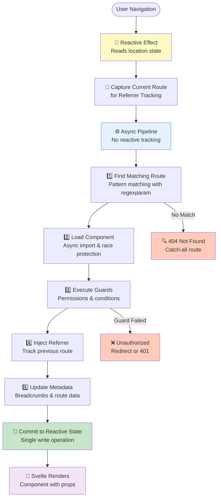

# Advanced topics

## Architecture

The router uses a **pipeline architecture** for clean separation of concerns:



### Key benefits

- **No `untrack()` calls needed**: pipeline runs outside reactive context
- **Race condition safety**: each navigation has a unique ID to prevent stale updates
- **Single write point**: all state updates happen in one place (`commitToReactiveState`)
- **Testable**: pure functions for each pipeline stage
- **Extensible**: easy to add new stages or modify existing ones

## Svelte 5 runes (not stores)

This router uses Svelte 5 runes throughout, not Svelte stores.

### 1. Stores are now functions

In the Svelte 5 version, location stores are accessed as functions instead of Svelte stores:

```svelte
<script>
import { location, querystring, routeParams } from '@keenmate/svelte-spa-router'
</script>
<p>Current location: {location()}</p>
<p>Querystring: {querystring()}</p>
<p>Params: {JSON.stringify(routeParams())}</p>
```

### 2. Event handlers use props instead of `on:` directives

```svelte
<Router {routes}
  onRouteLoading={handleLoading}
  onRouteLoaded={handleLoaded}
  onConditionsFailed={handleFailed}
/>
```

### 3. Internal implementation uses runes

The router uses:
- `$state` for reactive state management
- `$props` for component props
- `$effect` for side effects (location tracking, scroll restoration)
- `$derived` for computed values

### What NOT to do

- ❌ Don't use Svelte stores (`writable()`, `readable()`, `derived()`)
- ❌ Don't use `$:` reactive declarations (use `$derived()` instead)
- ❌ Don't use `export let` for props (use `let { prop } = $props()`)
- ❌ Don't use `.subscribe()` or `$store` syntax
- ❌ Don't use manual `push(referrer.location)` for "Go Back" (use `goBack()` helper for scroll restoration)

## Scroll restoration

```svelte
<Router {routes} restoreScrollState={true} />
```

Uses `history.scrollRestoration = 'manual'` and stores scroll positions in history state. The `goBack()` helper automatically restores scroll position when navigating to referrer. Manual `push()` does NOT restore scroll.

## Nested routers

```svelte
<!-- Parent router -->
<script>
import Router from '@keenmate/svelte-spa-router'
const routes = {
    '/hello': Hello,
    '/hello/*': Hello,
}
</script>

<!-- In Hello.svelte (child router) -->
<script>
import Router from '@keenmate/svelte-spa-router'
const prefix = '/hello'
const routes = {
    '/:name': NameView
}
</script>

<h2>Hello!</h2>
<Router {routes} {prefix} />
```

## Event handling

```svelte
<Router
    {routes}
    onRouteLoading={(e) => console.log('Loading:', e.detail)}
    onRouteLoaded={(e) => console.log('Loaded:', e.detail)}
    onConditionsFailed={(e) => console.log('Failed:', e.detail)}
    onNotFound={(e) => console.log('Not found:', e.detail)}
/>
```

**Event payloads (`e.detail`):**

| Event | Payload shape | Fires when |
|---|---|---|
| `onRouteLoading` | `{ route, location, relativeLocation, querystring, params }` | Before guards/conditions run for a matched route |
| `onRouteLoaded` | `{ route, location, relativeLocation, querystring, params, component?, name?, routeContext?, zones? }` | After the matched component (and any async children) successfully mounts. `zones` is set for multi-zone routes; `component`/`name`/`routeContext` for single-component routes |
| `onConditionsFailed` | `{ route, location, relativeLocation, querystring, params }` | A condition in `wrap({ conditions })` returned `false`. The slot is now empty — handle the redirect here or inside the condition itself |
| `onNotFound` | `{ location, relativeLocation, querystring }` | No route matched, *or* the `'*'` catch-all matched (it fires for both, so consumers can always log 404s) |

**`location` vs `relativeLocation`:**
- `location` is the **full app URL** as the browser sees it (e.g. `/test/embed/missing`). Use this for logging, analytics, or re-navigating with `push()` (which always takes app-wide paths).
- `relativeLocation` is the URL **after the Router's `prefix` has been stripped** (e.g. `/missing` for a `<Router prefix="/test/embed" />`). Use this when you're reasoning about what *this* Router instance saw — it matches how routes inside the Router were defined.
- For a root Router with no `prefix`, the two fields are identical.

## Quick reference

### All available imports

```javascript
// Core router
import Router from '@keenmate/svelte-spa-router'

// Navigation utilities
import { push, replace, pop, goBack, location, querystring, routeParams, navigationContext } from '@keenmate/svelte-spa-router'

// Named routes (for use with push/replace/link)
import { registerRoutes, buildUrl, defineRoutes } from '@keenmate/svelte-spa-router/routes'

// Route creation (recommended - no wrap() needed!)
import { createRoute, createRouteDefinition } from '@keenmate/svelte-spa-router/wrap'

// Route wrapping (advanced - for manual wrapping)
import { wrap } from '@keenmate/svelte-spa-router/wrap'

// Tree/nested route structure (alternative to flat routes)
import { createHierarchy } from '@keenmate/svelte-spa-router/helpers/hierarchy'

// Active link highlighting
import active from '@keenmate/svelte-spa-router/active'

// Configuration
import { setHashRoutingEnabled, setBasePath, setParamReplacementPlaceholder, setHierarchicalRoutesEnabled, setIncludeReferrer } from '@keenmate/svelte-spa-router'

// Querystring helpers (shared reactive state)
import { configureQuerystring, query } from '@keenmate/svelte-spa-router/helpers/querystring'

// Querystring helpers (individual functions)
import {
  parseQuerystring,
  stringifyQuerystring,
  updateQuerystring
} from '@keenmate/svelte-spa-router/helpers/querystring-helpers'

// Filter helpers
import {
  configureFilters,
  filters,
  updateFilters
} from '@keenmate/svelte-spa-router/helpers/filters'

// Permission system (recommended - no wrap() needed!)
import {
  configurePermissions,
  createProtectedRoute,
  hasPermission
} from '@keenmate/svelte-spa-router/helpers/permissions'

// Permission system (advanced - for manual wrapping)
import {
  createPermissionCondition,
  createProtectedRouteDefinition
} from '@keenmate/svelte-spa-router/helpers/permissions'

// Navigation guards
import {
  registerBeforeLeave,
  unregisterBeforeLeave,
  NavigationCancelledError,
  createDirtyCheckGuard
} from '@keenmate/svelte-spa-router/helpers/navigation-guard'

// Route metadata & loading control
import {
  showLoading,
  hideLoading,
  routeIsLoading,
  updateTitle,
  updateBreadcrumb,
  updateRouteMetadata,
  routeTitle,
  routeBreadcrumbs,
  routeContext
} from '@keenmate/svelte-spa-router/helpers/route-metadata'
```

### Common patterns

```svelte
<script>
import { routeParams } from '@keenmate/svelte-spa-router'
import { query } from '@keenmate/svelte-spa-router/helpers/querystring'
import { filters } from '@keenmate/svelte-spa-router/helpers/filters'
import active from '@keenmate/svelte-spa-router/active'

// Define types for intellisense
interface RouteParams {
  id: string
}

interface QueryParams {
  tab?: string
  search?: string
}

// Get route data reactively
const params = $derived(routeParams<RouteParams>())
const queryParams = $derived(query<QueryParams>())
const currentFilters = $derived(filters())

// Use in your component
const id = $derived(params?.id)
const tab = $derived(queryParams.tab || 'overview')
const search = $derived(queryParams.search || '')
</script>

<!-- Navigation with active highlighting -->
<nav>
  <a href="/" use:link use:active>Home</a>
  <a href="/about" use:link use:active>About</a>
</nav>

<!-- Display current route -->
<p>Current: {location()}</p>
```
